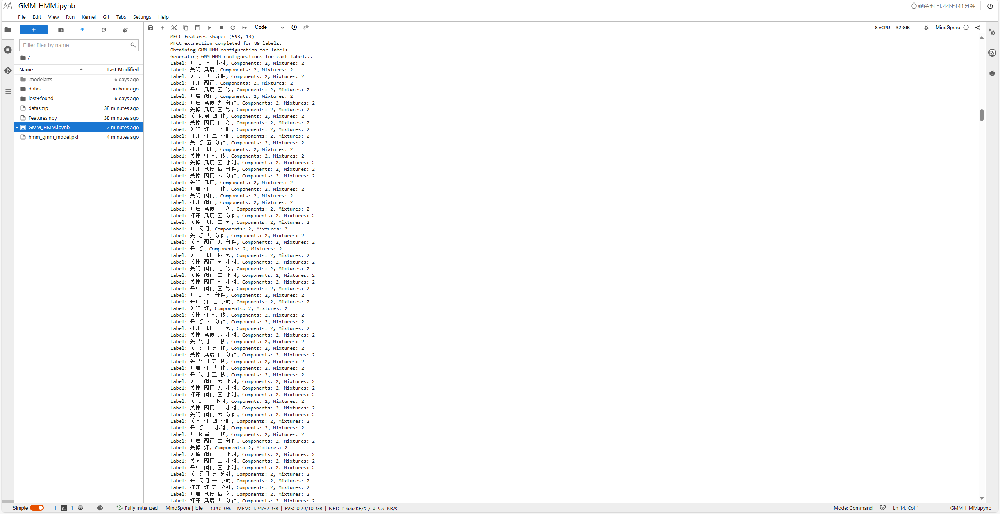
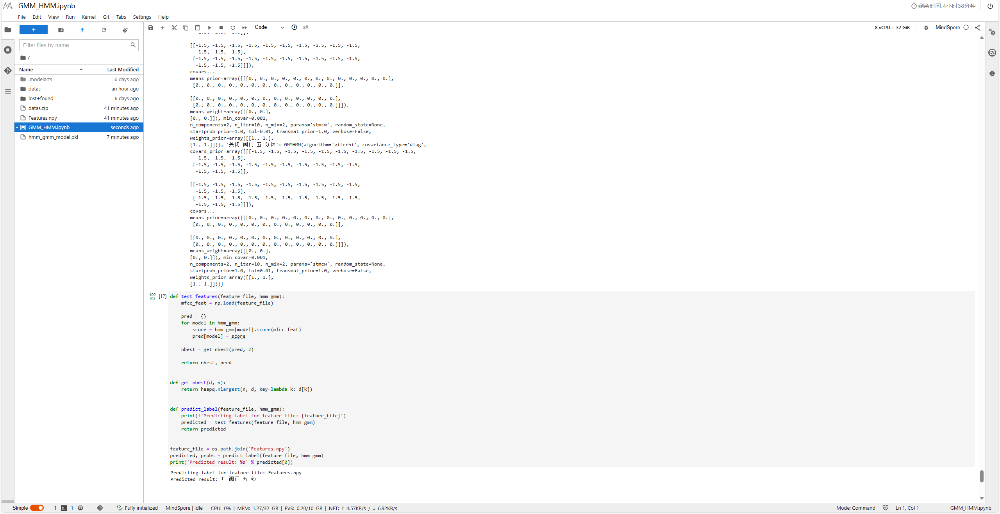

# GMM-HMM-based Continuous Word Speech Recognition

## 1 Experiment Objectives

* Master and reinforce the use of GMM (Gaussian Mixture Model) and HMM (Hidden Markov Model) related to speech recognition, and understand the GMM-HMM continuous speech recognition algorithm.
* Become familiar with the Huawei-provided MindSpore platform and Python 3.

## 2 Experiment Equipment

* **Hardware**: PC
* **Software**: MindSpore 1.1.1, Python 3.7, python_speech_features

## 3 Experiment Content

In this experiment, students will log in to the Huawei Cloud official website and run the GMM-HMM-based continuous speech recognition code on the MindSpore platform with the given dataset to recognize the textual content from the test audio.

## 4 Environment Configuration

### 4.1 Online Service Environment Setup

* Access [Huawei Cloud ModelArts Console](https://console.huaweicloud.com/modelarts).
* On the creation interface, select **mindspore1.7.0-py3.7-ubuntu18.04** from the public images. Leave the other settings as default and click "Create Now" to complete the Notebook training job creation process.
* Launch the Notebook to enter the development environment.

### 4.2 Data Preparation

Upload `datas.zip` to the server and run `unzip datas.zip` in the terminal.

### 4.3 Training and Inference

Copy the code into the ipynb file for training and inference. Be sure to first execute the installation commands for the Python libraries:

```bash
pip install python_speech_features hmmlearn
```

## 5 MFCC Extraction

In Assignment 1, during MFCC feature extraction, the features extracted by the custom functions in the `MFCC_Extraction.ipynb` file are saved as the `Features.npy` file.

```python
np.save('Features.npy', mfcc_features)
```

## 6 Training GMM-HMM Models

### 6.1 Importing Libraries

In this section, the necessary libraries for speech processing and machine learning are imported. `os` is used for handling file paths, `pickle` for saving/loading models, `numpy` for array manipulations, and `scipy` for reading and processing audio files. `mfcc` from the `python_speech_features` package is used for extracting Mel Frequency Cepstral Coefficients (MFCC) features, which are commonly used in speech recognition. `hmmlearn.hmm.GMMHMM` is used for the Gaussian Mixture Model - Hidden Markov Model (GMM-HMM) for speech recognition tasks.

```python
import os
import pickle
import numpy as np
import scipy.io.wavfile as wvf
from python_speech_features import mfcc
from hmmlearn.hmm import GMMHMM
import heapq
import scipy.signal as signal
from python_speech_features import delta
from scipy.fftpack import dct


train_data_path = os.path.join(os.getcwd(), 'datas/train/speech')
label_path = os.path.join(os.getcwd(), 'datas/labels/trainprompts_m')
test_data_path = os.path.join(os.getcwd(), 'datas/test/speech')
model_path = 'hmm_gmm_model.pkl'
```

### 6.2 MFCC Feature Extraction

This function extracts MFCC features from the audio files. For each label, it reads the corresponding audio file (WAV format), extracts the MFCC features using the `python_speech_features.mfcc` function, and stores them in a dictionary. The shape of the MFCC features is printed to verify that the extraction is correct. This is a crucial step for converting raw audio signals into numerical features that can be used for machine learning models.

```python
def wav2mfcc(labels, data_paths):
    trng_data = {}
    for label, data_path in zip(labels, data_paths):
        print(f'Processing file: {data_path}')
        mfccs = []
        rate, sig = wvf.read(data_path)
        print(f'Read wav file {data_path}, sample rate: {rate}, signal length: {len(sig)}')

        mfcc_feat = mfcc(sig, rate)
        print(f'MFCC Features shape: {mfcc_feat.shape}')

        mfccs.append(mfcc_feat)
        trng_data[label] = mfccs

    print(f'MFCC extraction completed for {len(trng_data)} labels.')
    return trng_data
```

### 6.3 GMM-HMM Configuration

This function generates configuration settings for each label in the dataset. For each label, it sets the number of components (`n_components`) and the number of mixtures (`n_mix`) for the GMM-HMM model. These parameters define the structure of the GMM-HMM, which is used for modeling the probabilistic transitions and emissions in speech recognition tasks. The configurations are printed for verification.

```python
def obtain_config(labels):
    conf = {}
    print('Generating GMM-HMM configurations for each label...')
    for label in labels:
        conf[label] = {}
        conf[label]['n_components'] = 2
        conf[label]['n_mix'] = 2
        print(f"Label: {label}, Components: {conf[label]['n_components']}, Mixtures: {conf[label]['n_mix']}")
    return conf
```

### 6.4 Training GMM-HMM Models

This function trains the GMM-HMM models for each label in the dataset. For each label, it creates a new GMM-HMM model using the specified configuration (number of components and mixtures) and fits it to the corresponding training data. After training, the models are saved to a file using `pickle`. If a pre-trained model exists, it can be loaded from the file instead. This allows the model to be reused without retraining, saving time during testing.

```python
def get_hmm_gmm(trng_datas=None, GMM_configs=None, model_path='hmm_gmm_model.pkl', from_file=False):
    hmm_gmm = {}

    if not from_file:
        print('Training GMM-HMM models...')
        for label, trng_data in trng_datas.items():
            GMM_config = GMM_configs[label]
            print(f"Training model for label: {label} with {GMM_config['n_components']} components and {GMM_config['n_mix']} mixtures")
            hmm_gmm[label] = GMMHMM(
                n_components=GMM_config['n_components'],
                n_mix=GMM_config['n_mix'])
            if trng_data:
                hmm_gmm[label].fit(np.vstack(trng_data))
                print(f'Fitted model for label: {label}')

        # Save the trained model
        pickle.dump(hmm_gmm, open(model_path, 'wb'))
        print(f'Model saved to {model_path}')
    else:
        print(f'Loading model from {model_path}')
        hmm_gmm = pickle.load(open(model_path, 'rb'))

    print('Returning GMM-HMM models.')
    return hmm_gmm
```

### 6.5 Training Pipeline

The `train` function orchestrates the entire training process. It first reads the labels from the label file, constructs file paths for the training data, and extracts the corresponding MFCC features. Then, it generates the configuration settings for the GMM-HMM models and trains the models using the `get_hmm_gmm` function. Finally, the trained models are saved to a file for future use. The function returns the trained models.

```python
def train(train_data_path, label_path, model_path):
    print(f'Reading labels from {label_path}...')
    with open(os.path.join(label_path)) as f:
        labels = f.readlines()

    data_paths = [train_data_path + '/' + line.split()[0] + '.wav' for line in labels]
    print(f'Data paths: {data_paths[:5]}...')  # Show a sample of the first 5 paths

    labels = [' '.join(line.split()[1:]).strip() for line in labels]
    print(f'Labels: {labels[:5]}...')  # Show a sample of the first 5 labels

    print('Extracting MFCC features for training data...')
    train_datas = wav2mfcc(labels, data_paths)

    print('Obtaining GMM-HMM configuration for labels...')
    GMM_configs = obtain_config(labels)

    print('Training GMM-HMM models...')
    hmm_gmm = get_hmm_gmm(train_datas, GMM_configs, model_path)

    print(f'Training complete. Models saved to {model_path}')
    return hmm_gmm


hmm_gmm = train(train_data_path, label_path, model_path)
print(f'Trained HMM-GMM models: {hmm_gmm}')
```

## 7 Testing Models and Predicting Labels

This function tests the trained GMM-HMM models by scoring them against the MFCC features from a given test file. The MFCC features are loaded from the file, and then each model is used to compute a score for the features. The models are ranked based on their scores, and the top N predictions are returned. This allows us to determine which model best matches the input features.

```python
def test_features(feature_file, hmm_gmm):
    print(f'Loading MFCC features from {feature_file}...')
    mfcc_feat = np.load(feature_file)
    print(f'MFCC features shape: {mfcc_feat.shape}')

    print('Scoring features against each model...')
    pred = {}
    for model in hmm_gmm:
        score = hmm_gmm[model].score(mfcc_feat)
        pred[model] = score
        print(f'Score for model {model}: {score}')

    nbest = get_nbest(pred, 2)

    return nbest, pred
```

This helper function selects the top N predictions based on their scores. It uses Python's `heapq.nlargest` to find the largest scores in the dictionary, allowing us to extract the best N models based on the scores computed in the `test_features` function.

```python
def get_nbest(d, n):
    return heapq.nlargest(n, d, key=lambda k: d[k])
```

This function uses the `test_features` function to predict the label for a given feature file. It returns the top N predictions (labels) along with their corresponding scores. This is the final step in applying the trained models to new data to make predictions.

```python
def predict_label(feature_file, hmm_gmm):
    print(f'Predicting label for feature file: {feature_file}')
    predicted = test_features(feature_file, hmm_gmm)
    return predicted
```

In this example, the predict_label function is called with the path to a test feature file (`Features.npy`). The predicted label and the corresponding probabilities are printed. This allows the user to see the model’s prediction for the given test data.

```python
feature_file = os.path.join('Features.npy')
predicted, probs = predict_label(feature_file, hmm_gmm)
print('Predicted result: %s' % predicted[0])
```

## 8 Results Output







## 9 Conclusion

In this experiment, we implemented and explored a GMM-HMM-based continuous speech recognition system. The main objectives were to apply Gaussian Mixture Models (GMM) and Hidden Markov Models (HMM) to process speech data, extract relevant features using Mel Frequency Cepstral Coefficients (MFCC), and build a speech recognition model on the Huawei MindSpore platform.

The experiment involved setting up the environment on Huawei Cloud’s ModelArts platform, uploading the dataset, and installing the necessary Python libraries, such as python_speech_features and hmmlearn. We then extracted MFCC features from the speech data and used these features to train GMM-HMM models, which were subsequently saved for future inference. The models were tested by scoring them against a separate test dataset, and the top predictions were made by ranking the models based on their scores. Finally, the trained models were used to predict labels for unseen data, achieving the goal of speech content recognition.

The experiment's results were promising, with the GMM-HMM models effectively learning the speech patterns and providing accurate predictions on the test data. The use of GMM-HMM helped model the probabilistic nature of speech transitions, and the MindSpore platform allowed for a smooth implementation and execution of the training and testing processes.

However, if there is a significant difference between the features you extract manually and the features returned by platform interfaces, it is essential to analyze potential causes. Possible reasons could include variations in the feature extraction process (such as the number of MFCC coefficients or the use of different windowing techniques), discrepancies in pre-processing steps (like normalization or filtering), or differences in the audio sample rates. Ensuring consistency in these parameters can help improve the alignment between self-extracted features and those generated by platform tools.