# MFCC Extraction

## 1 Introduction

In this report, we detail the process of extracting Mel Frequency Cepstral Coefficients (MFCC) from an audio signal. MFCC is a widely used feature in speech and audio processing, known for its effectiveness in capturing the characteristics of the human voice. This document outlines each step, from signal pre-processing to feature extraction and transformation, with a comparison to the standard `librosa` implementation.

## 2 Environment Configuration

The environment configuration involves setting up a Python environment with the necessary libraries for MFCC extraction. We create a new Conda environment with Python 3.9 and install essential packages such as `numpy`, `matplotlib`, `scipy`, `scikit-learn`, `librosa`, and `ipython`. These packages are used for signal processing, feature extraction, and visualization throughout the process.

```bash
conda create -n mfcc_extraction python=3.9
conda activate mfcc_extraction
pip install numpy matplotlib scipy scikit-learn librosa ipython
```

## 3 Processing Steps

### 3.1 Import Packages and Load Audio

In this step, we import the necessary libraries for audio processing and feature extraction. We load the audio file ( `Record.wav` ) and extract both the signal and its sampling rate using `librosa.load()`, setting the sample rate to `None` to retain the original rate.

```python
# Import necessary libraries
import librosa
import librosa.display
import numpy as np
import matplotlib.pyplot as plt
import random
from scipy.fftpack import dct
from sklearn.decomposition import PCA

# Load the audio signal and sampling rate from the file
signal, fs = librosa.load('Record.wav', sr=None)
```

This figure displays the waveform of the original audio signal, showing the amplitude variations over time. The x-axis represents time in seconds, while the y-axis shows the amplitude of the signal.

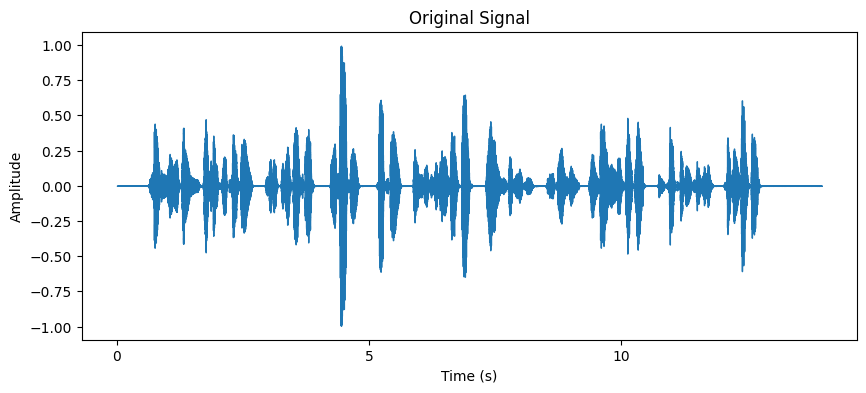

### 3.2 Pre-emphasis

The pre-emphasis step is used to boost the high-frequency components of the audio signal, which tend to be weaker compared to low-frequency components. This process applies a filter to emphasize higher frequencies by subtracting a scaled version of the previous sample from the current sample. This enhances the signal-to-noise ratio for the higher frequencies, making them more distinguishable and improving feature extraction for processes like MFCC.

```python
def pre_emphasis(signal, alpha=0.97):
    """
    Apply pre-emphasis to the input audio signal.

    Args:
        signal (numpy.ndarray): The input audio signal.
        alpha (float): Pre-emphasis filter coefficient. Default is 0.97.

    Returns:
        numpy.ndarray: The emphasized signal.
    """
    return np.append(signal[0], signal[1:] - alpha * signal[:-1])


# Apply pre-emphasis to the original signal
emphasized_signal = pre_emphasis(signal)
```

The first image compares the waveform of the original audio signal (top) with the emphasized signal after applying the pre-emphasis filter (bottom). In the emphasized signal, the higher frequencies are more pronounced, particularly at sharp changes in the waveform, highlighting the effect of the pre-emphasis step.

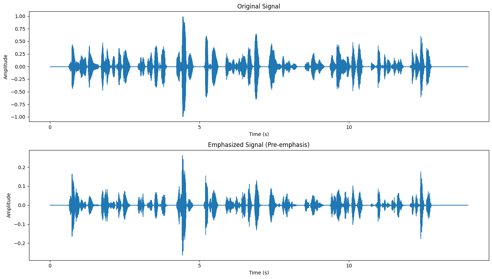

The second image displays the frequency spectrum of both the original (top) and pre-emphasized signal (bottom). After pre-emphasis, the lower frequencies are attenuated while the higher frequencies are amplified. This change reflects the purpose of pre-emphasis: to enhance high-frequency components and reduce the dynamic range, leading to a more balanced spectrum for analysis.

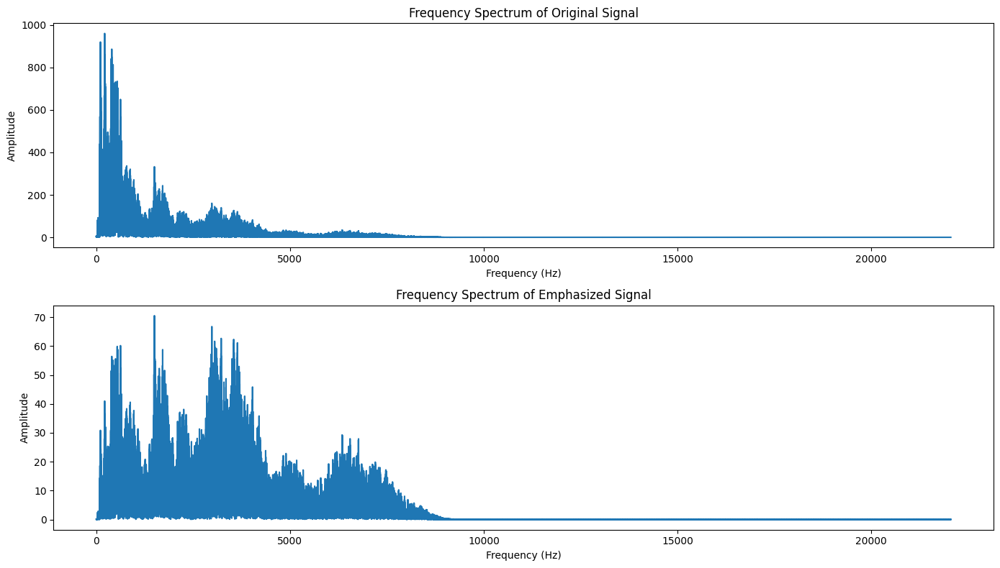

### 3.3 Windowing

In this step, the audio signal is divided into overlapping frames, each of which is multiplied by a Hamming window. The purpose of windowing is to mitigate edge effects by smoothing the transitions between frames, as sharp discontinuities at the frame edges could distort the frequency spectrum during the subsequent Fourier transform. The Hamming window minimizes these discontinuities by reducing the signal amplitude near the frame boundaries while maintaining the center of the frame unaffected.

```python
def framing(signal, frame_size, frame_stride, fs):
    """
    Frame the signal into overlapping frames and apply a window function (Hamming window).

    Args:
        signal (numpy.ndarray): The input audio signal.
        frame_size (float): Frame size in seconds.
        frame_stride (float): Frame stride in seconds.
        fs (int): Sampling rate of the signal.

    Returns:
        numpy.ndarray: A 2D array where each row is a frame of the signal.
    """
    # Convert frame size and stride from seconds to samples
    frame_length, frame_step = frame_size * fs, frame_stride * fs
    frame_length = int(round(frame_length))
    frame_step = int(round(frame_step))

    # Calculate total number of frames and pad the signal if necessary
    signal_length = len(signal)
    total_frames = int(np.ceil(float(np.abs(signal_length - frame_length) / frame_step)))
    padded_signal_length = total_frames * frame_step + frame_length

    # Zero-padding the signal to match the required frame length
    zeros = np.zeros((padded_signal_length - signal_length))
    padded_signal = np.append(signal, zeros)

    # Create indices for frames (each row corresponds to a frame)
    indices = np.tile(np.arange(0, frame_length), (total_frames, 1)) + np.tile(np.arange(0, total_frames * frame_step, frame_step), (frame_length, 1)).T

    # Extract frames from the padded signal
    frames = padded_signal[indices.astype(np.int32, copy=False)]

    # Apply a Hamming window to each frame
    window = np.hamming(frame_length)
    frames_windowed = frames * window

    return frames, frames_windowed, frame_length, total_frames


# Define frame size and stride in seconds
frame_size = 0.025
frame_stride = 0.01

# Apply framing and windowing to the emphasized signal
frames, frames_windowed, frame_length, total_frames = framing(emphasized_signal, frame_size, frame_stride, fs)
```

The first image compares selected frames before and after applying the Hamming window. On the left, the signal is framed without the window, resulting in sharp edges at the boundaries of each frame. On the right, the frames processed with the Hamming window show smoother transitions at the edges, which reduces the likelihood of introducing spectral artifacts in the later steps.

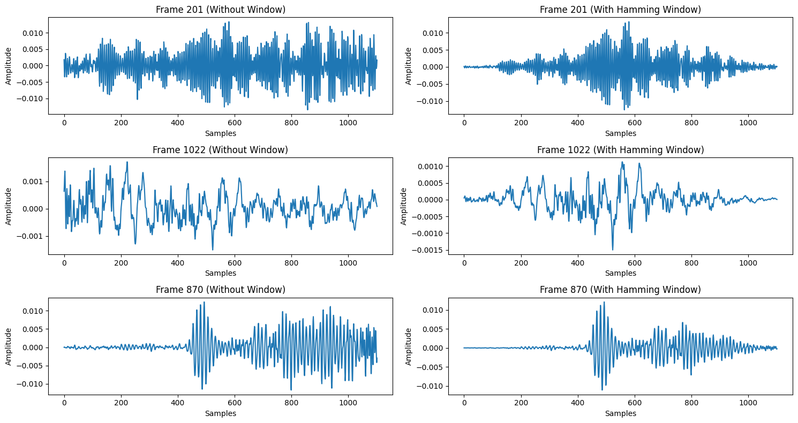

The second image shows an overlay of multiple frames before (top) and after (bottom) applying the Hamming window. In the top plot, the frames without windowing exhibit significant amplitude variations at the edges, which can cause unwanted effects during spectral analysis. The bottom plot shows that after applying the Hamming window, the frames have smooth, tapered edges, leading to better signal representation when the frames are analyzed in the frequency domain.

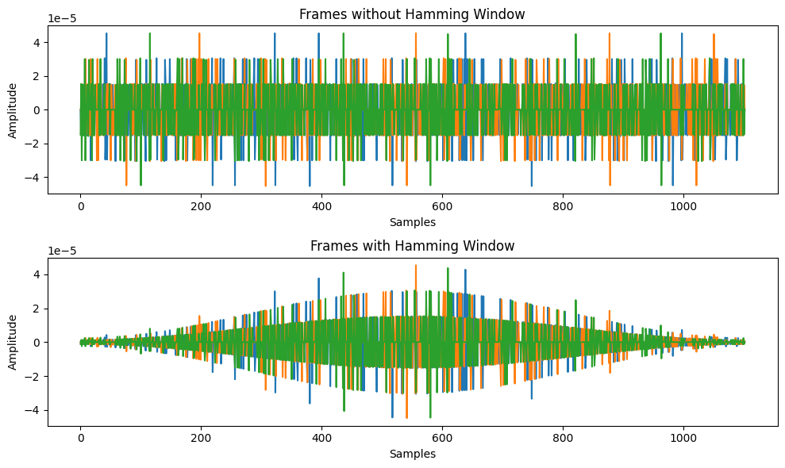

### 3.4 Short-Time Fourier Transform (STFT)

The Short-Time Fourier Transform (STFT) is used to convert a time-domain signal into the frequency domain by analyzing small, overlapping frames of the signal. For each frame, the Fourier transform is computed, producing a spectrum that reflects how the frequency content of the signal changes over time. The STFT breaks the signal into individual frames, applies the Fourier transform to each, and generates a time-frequency representation, where each point in the spectrum corresponds to a specific time and frequency.

```python
def stft(frames, NFFT):
    """
    Perform Short-Time Fourier Transform on the input frames.

    Args:
        frames (numpy.ndarray): The input frames, each row is a frame.
        NFFT (int): Number of FFT points, determines the frequency resolution.

    Returns:
        numpy.ndarray: The magnitude spectrum of each frame.
    """
    # Compute the magnitude of the FFT for each frame
    mag_frames = np.abs(np.fft.rfft(frames, NFFT))

    # Compute the power spectrum (squared magnitude normalized by the number of FFT points)
    pow_frames = ((1.0 / NFFT) * (mag_frames ** 2))

    return pow_frames


# Set the number of FFT points (frequency resolution)
NFFT = 512

# Perform STFT on the frames
spectrum = stft(frames, NFFT)
```

The first image shows the frequency spectra of individual frames (356, 597, and 1257) from the audio signal. Each plot reveals the frequency components present in the respective frame, with lower frequencies showing stronger magnitudes, indicating that these frequencies dominate in those frames.

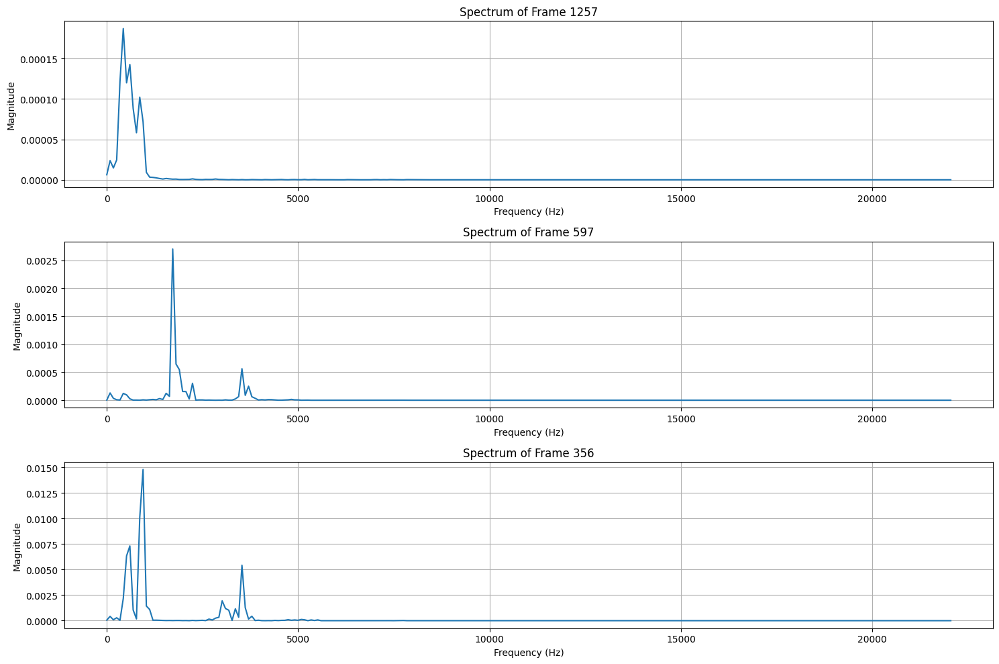

The second image compares the frequency spectrum of the entire signal (top) with that of a specific frame (frame 510, bottom). The full signal’s spectrum shows a wide range of frequencies present throughout the recording, while the individual frame shows more localized frequency peaks, focusing on specific frequencies at that time point.

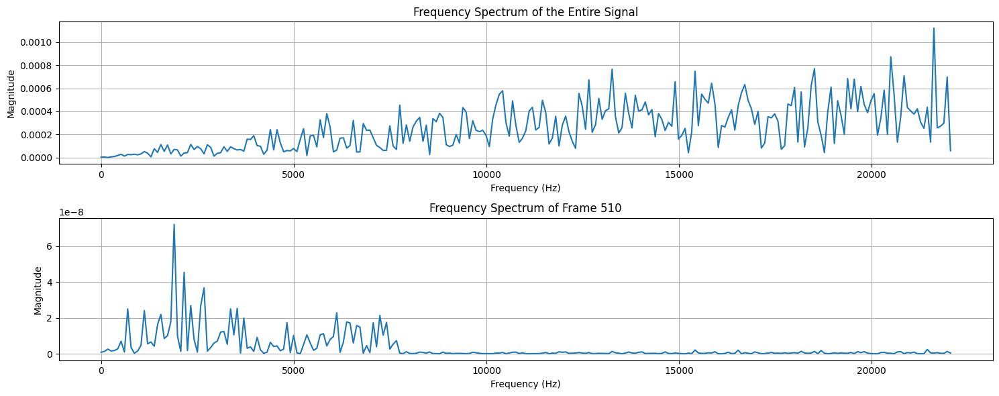

This 3D spectrogram illustrates the result of applying STFT to the signal. The x-axis represents the frame index (or time), the y-axis shows frequency in Hertz, and the z-axis indicates the magnitude of the signal in decibels (dB). The colors range from green to yellow, with yellow regions indicating higher magnitudes (stronger frequencies), while green and blue represent lower magnitudes. This visualization helps to observe how the frequency components of the signal evolve over time.

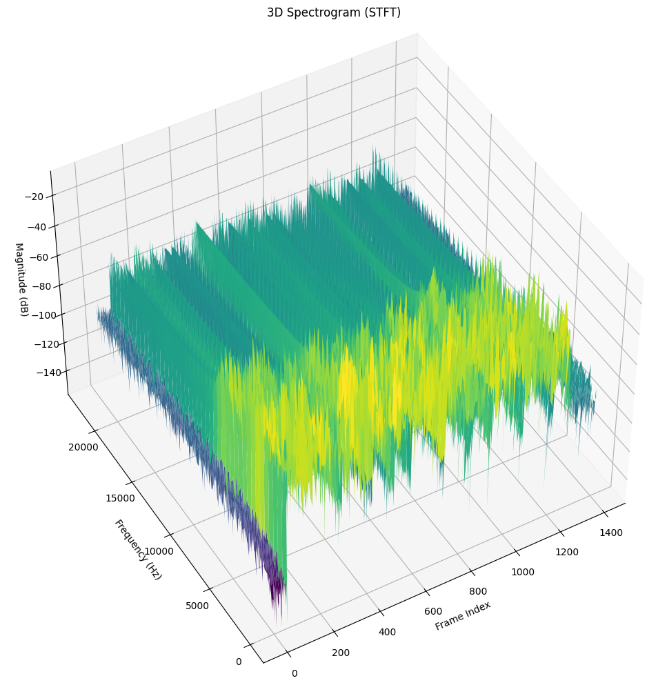

### 3.5 Mel-filter Bank

The Mel-filter bank is designed to mimic the human ear's perception of sound, where the frequency scale is logarithmic rather than linear. It consists of a series of triangular filters spaced along the Mel scale, which emphasize different frequency bands. The Mel scale compresses high frequencies and expands low frequencies to better represent how humans perceive pitch. This transformation is critical for extracting meaningful features (like MFCCs) from audio signals.

```python
def mel_filter_bank(num_filters, NFFT, fs):
    """
    Generate Mel filter banks.

    Args:
        num_filters (int): The number of Mel filters.
        NFFT (int): Number of FFT points, determines frequency resolution.
        fs (int): Sampling rate of the signal.

    Returns:
        numpy.ndarray: Mel filter banks, shape (num_filters, NFFT // 2 + 1).
    """
    # Convert the low and high frequencies to the Mel scale
    low_freq_mel = 0
    high_freq_mel = 2595 * np.log10(1 + (fs / 2) / 700)

    # Create evenly spaced Mel points
    mel_points = np.linspace(low_freq_mel, high_freq_mel, num_filters + 2)

    # Convert Mel points back to Hz
    hz_points = 700 * (10 ** (mel_points / 2595) - 1)

    # Map Hz points to corresponding FFT bin numbers
    bin_points = np.floor((NFFT + 1) * hz_points / fs)

    # Initialize the filter bank matrix
    filters = np.zeros((num_filters, int(np.floor(NFFT / 2 + 1))))

    # Create triangular filters between successive Mel points
    for m in range(1, num_filters + 1):
        f_m_minus = int(bin_points[m - 1])
        f_m = int(bin_points[m])
        f_m_plus = int(bin_points[m + 1])

        # Construct the left side of the triangular filter
        for k in range(f_m_minus, f_m):
            filters[m - 1, k] = (k - bin_points[m - 1]) / (bin_points[m] - bin_points[m - 1])

        # Construct the right side of the triangular filter
        for k in range(f_m, f_m_plus):
            filters[m - 1, k] = (bin_points[m + 1] - k) / (bin_points[m + 1] - bin_points[m])

    return filters

# Set the number of Mel filters
num_filters = 40

# Generate the Mel filter bank and apply it to the spectrum
filters = mel_filter_bank(num_filters, NFFT, fs)
mel_spectrum = np.dot(spectrum, filters.T)

# Replace zero values in the Mel spectrum with a small positive value to avoid log issues
mel_spectrum = np.where(mel_spectrum == 0, np.finfo(float).eps, mel_spectrum)
```

The first image shows the response of the Mel-filter bank, illustrating how each triangular filter responds to different frequency bands. The x-axis represents the frequency in Hertz, and the y-axis shows the filter amplitude. Each filter covers a specific range of frequencies, gradually increasing and decreasing to capture energy in those bands.

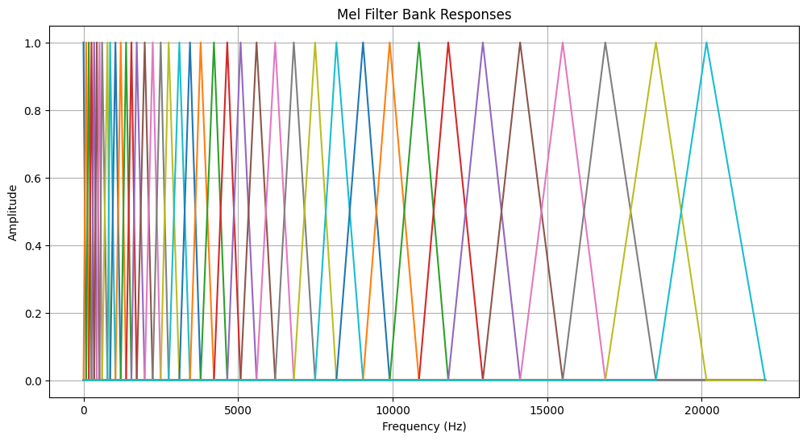

The second image is a 3D heatmap that represents the Mel-filter bank responses. The x-axis corresponds to the Mel filter index, the y-axis represents the frequency in Hertz, and the z-axis shows the amplitude. The plot provides a clear visual representation of how each Mel filter reacts to different frequencies in the audio signal.

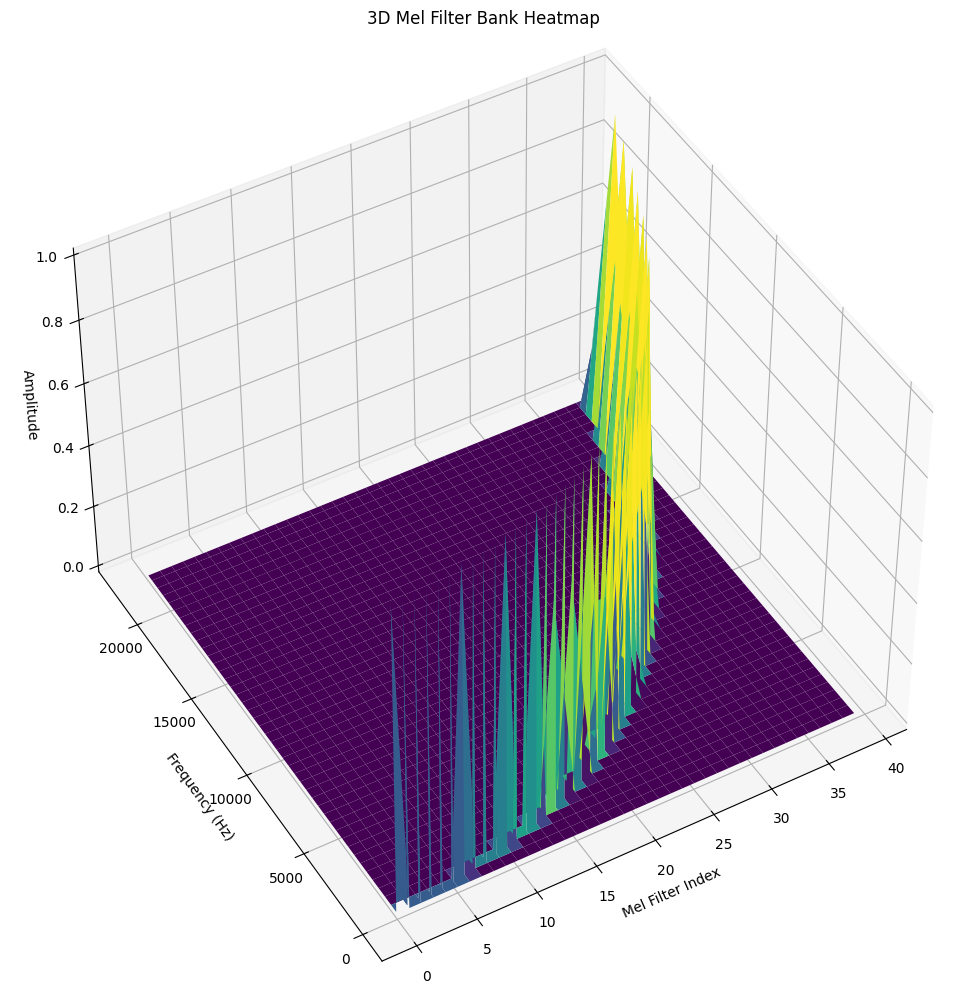

The third image is a 3D spectrogram of the Mel-filtered signal. The x-axis represents the frame index (time), the y-axis represents the Mel filter index (frequency bands), and the z-axis indicates the magnitude in decibels (dB). The color variations represent different energy levels across time and frequency.

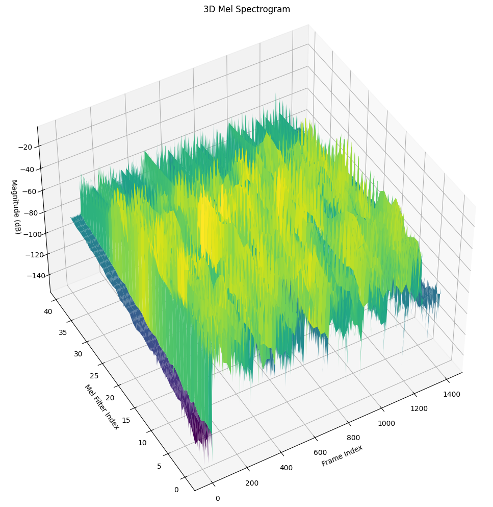

The fourth image displays the Mel spectrum for three randomly selected frames from the audio signal. Each frame shows how the energy is distributed across the Mel filters, providing insights into the frequency content at different points in time.

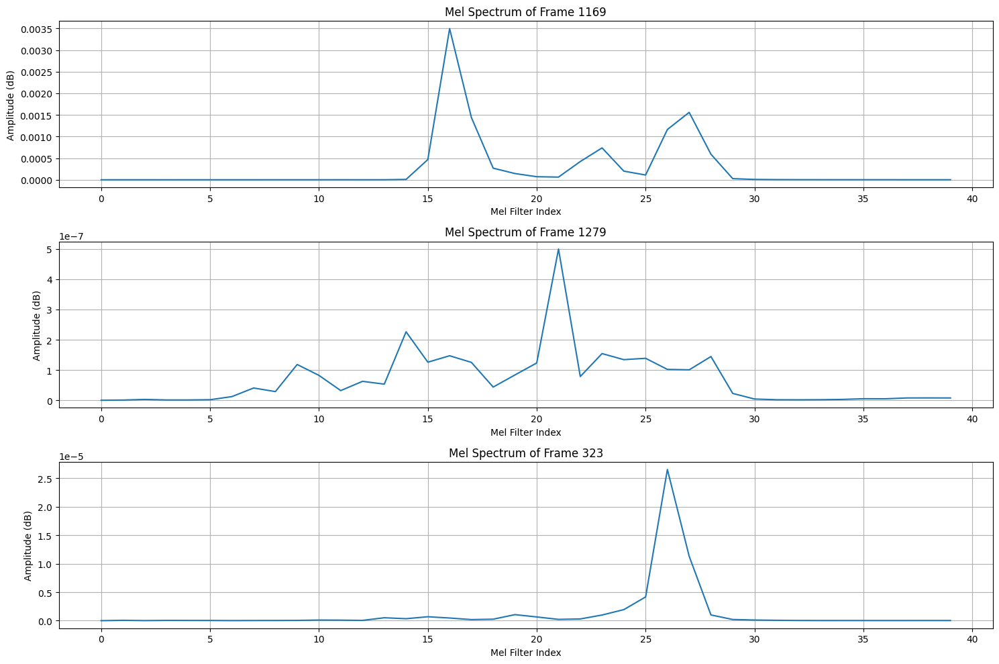

### 3.6 Log Transformation

Log transformation is used to compress the dynamic range of the Mel spectrum, simulating how the human ear perceives loudness. This operation converts the spectrum values to a logarithmic scale (in decibels), which allows the smaller magnitude values to be more prominent while compressing the larger ones. This step enhances the interpretability of the frequency content by focusing on perceptually relevant information.

```python
def log_magnitude(x):
    """
    Apply logarithmic compression to the input spectrum to simulate human perception.

    Args:
        x (numpy.ndarray): The input spectrum (e.g., Mel spectrum).

    Returns:
        numpy.ndarray: The logarithmically compressed spectrum.
    """
    # Convert to logarithmic scale (in dB)
    return 10 * np.log10(x)

# Apply log transformation to the Mel spectrum
log_mel_spectrum = log_magnitude(mel_spectrum)
```

The first image displays the 3D log Mel spectrogram, where the Mel-filtered spectrum has been transformed into the logarithmic (dB) scale. The x-axis represents the frame index (time), the y-axis corresponds to the Mel filter index (frequency bands), and the z-axis shows the magnitude in decibels (dB).

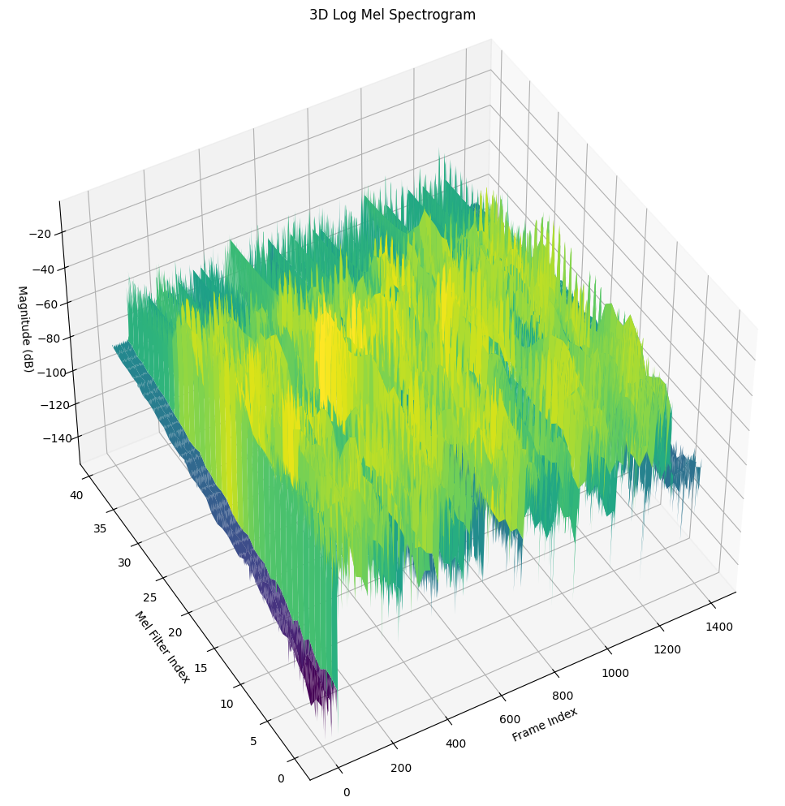

The second image shows the log Mel spectrum for three randomly selected frames, demonstrating how the log transformation has compressed the range of values, allowing easier visualization of variations in magnitude across the Mel filters for each frame.

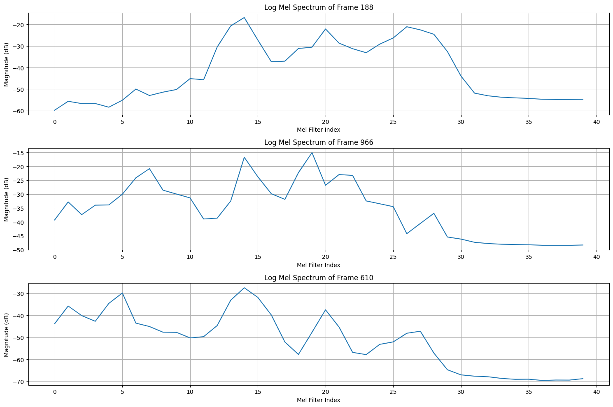

### 3.7 Discrete Cosine Transform (DCT)

The Discrete Cosine Transform (DCT) is applied to the log Mel spectrum to generate Mel Frequency Cepstral Coefficients (MFCCs). This process transforms the frequency-domain representation into a set of coefficients that capture the signal's energy distribution across different frequency bands. The first few MFCCs represent the most important features of the sound, while higher-order coefficients capture finer details. This makes MFCCs highly useful for speech and audio recognition tasks.

```python
# Apply DCT to the log Mel spectrum to compute MFCC features
mfcc_features = dct(log_mel_spectrum, type=2, axis=1, norm='ortho')[:, :13]
```

The first image is a 3D plot of the MFCCs across different frames. The x-axis represents the frame index (time), the y-axis corresponds to the MFCC coefficient index (feature dimensions), and the z-axis shows the magnitude of the coefficients. The structure of the MFCCs allows us to observe how sound characteristics evolve over time, with the lower coefficients (near the origin) containing most of the signal's energy.

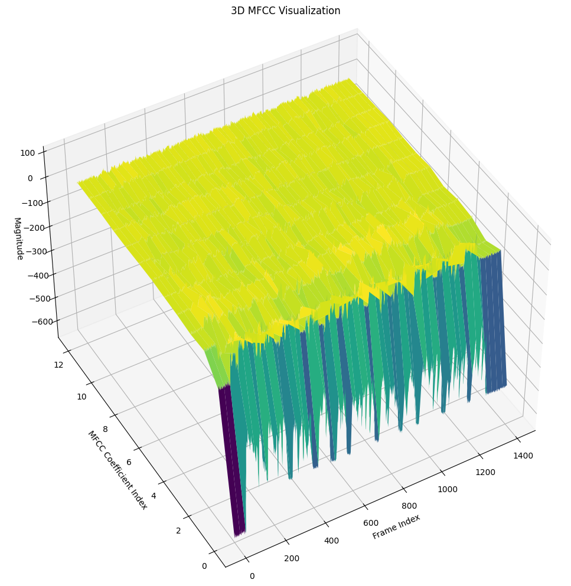

The second image shows the MFCCs for three randomly selected frames. Each plot represents the MFCC values for one frame, with the x-axis corresponding to the coefficient index and the y-axis representing the magnitude. The first coefficient is typically larger, capturing the overall energy of the frame, while the other coefficients reflect more subtle spectral details.

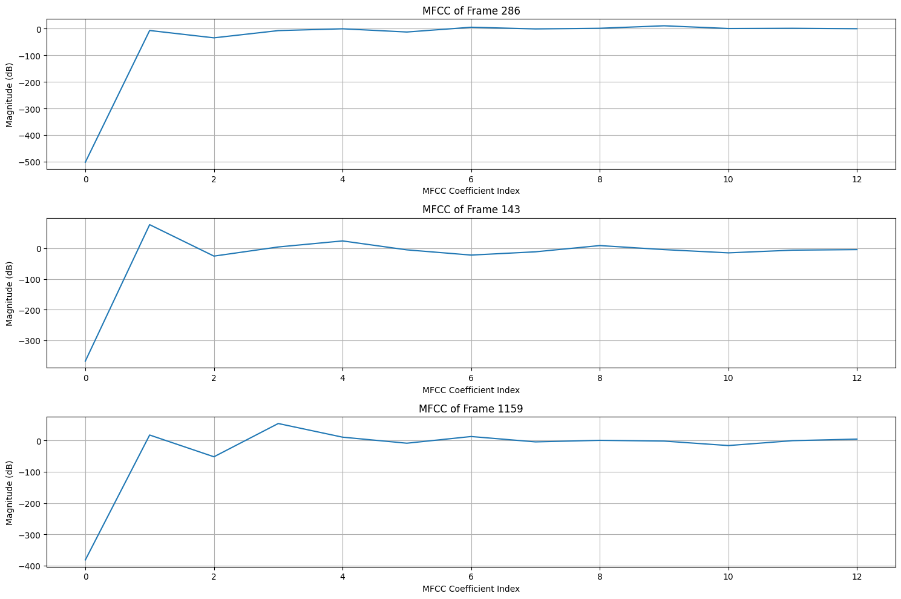

### 3.8 Dynamic Feature Extraction

Dynamic feature extraction, specifically the calculation of delta and delta-delta (second-order) features, captures the rate of change in the MFCC coefficients over time. This process provides additional information about the temporal dynamics of the signal, improving the robustness of speech or audio recognition systems.

```python
def delta(feature_matrix, N=2):
    """
    Calculate delta (derivative) of the feature matrix.

    Args:
        feature_matrix (numpy.ndarray): Input feature matrix (e.g., MFCCs).
        N (int): The window size for calculating the delta.

    Returns:
        numpy.ndarray: Delta feature matrix.
    """
    # Number of frames in the feature matrix
    num_frames, _ = feature_matrix.shape

    # Denominator for the delta calculation
    denominator = 2 * sum([i ** 2 for i in range(1, N + 1)])

    # Initialize the delta feature matrix with the same shape
    delta_feature = np.empty_like(feature_matrix)

    # Pad the feature matrix at the edges to handle boundary conditions
    padded = np.pad(feature_matrix, ((N, N), (0, 0)), mode='edge')

    # Compute the delta for each frame
    for t in range(num_frames):
        delta_feature[t] = np.dot(np.arange(-N, N + 1), padded[t: t + 2 * N + 1]) / denominator

    return delta_feature

# Compute the first-order delta (Delta) of the MFCC features
delta1 = delta(mfcc_features)

# Compute the second-order delta (Delta-Delta) of the first-order delta
delta2 = delta(delta1)
```

The first image is a 3D plot showing the delta (first-order) MFCC features over time, illustrating how the MFCC coefficients evolve and change across frames.

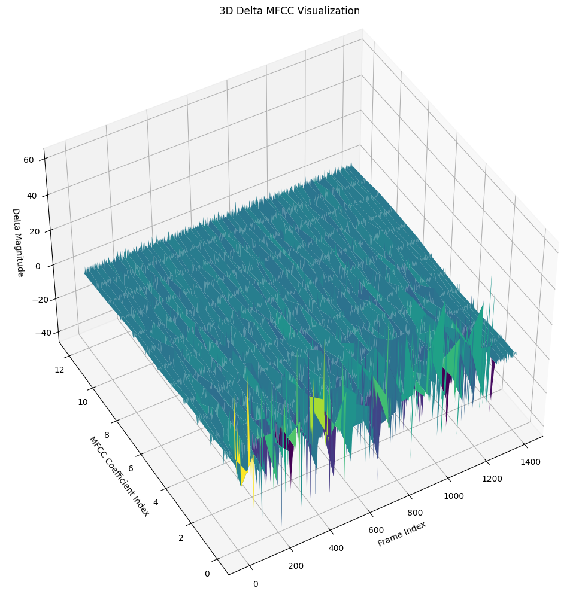

The second image displays the delta MFCC values for three randomly selected frames, highlighting the temporal variations in the MFCC coefficients.

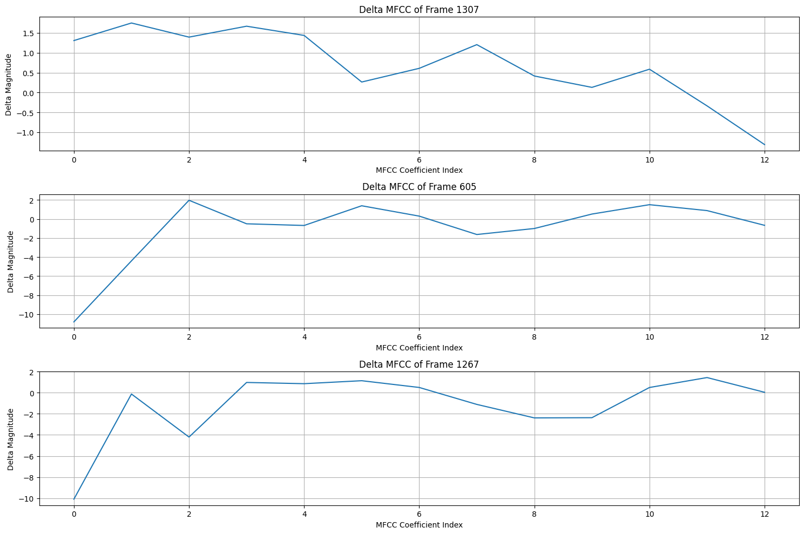

The third image is a 3D plot of the delta-delta (second-order) MFCC features over time, further detailing the acceleration of changes in the MFCC values between frames.

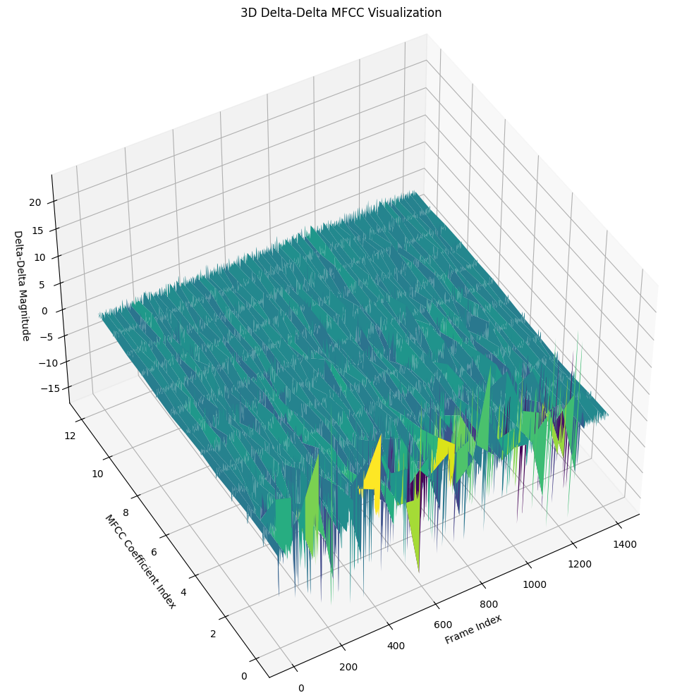

The fourth image shows the delta-delta MFCC values for three randomly selected frames, illustrating the subtle but critical changes in MFCC coefficients' rate of change across time.

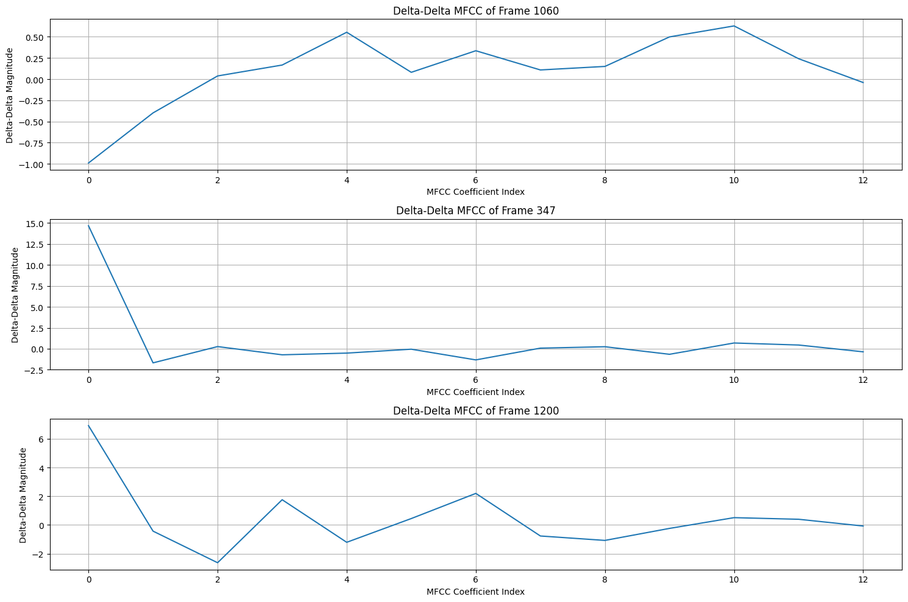

### 3.9 Feature Transformation

Feature transformation in the MFCC pipeline involves combining the MFCCs, delta, and delta-delta features into a single feature set. To ensure consistency across different recordings and eliminate biases, the features undergo mean normalization (subtracting the mean) and variance normalization (dividing by the standard deviation). These transformations make the features more robust and suitable for machine learning models by removing noise and standardizing the data's scale.

```python
# Stack the MFCC, Delta, and Delta-Delta features horizontally (combine them into one feature set)
stacked_features = np.hstack((mfcc_features, delta1, delta2))

# Mean normalization: subtract the mean of each feature across all frames
cmn_features = stacked_features - np.mean(stacked_features, axis=0)

# Variance normalization: divide by the standard deviation of each feature
cvn_features = cmn_features / np.std(cmn_features, axis=0)
```

The image is a 3D plot showing the normalized MFCC, delta, and delta-delta features across time. The x-axis represents the frame index, the y-axis represents the combined feature index, and the z-axis displays the normalized feature values. The plot demonstrates how the features vary and evolve over time, highlighting the smooth transitions achieved through normalization.

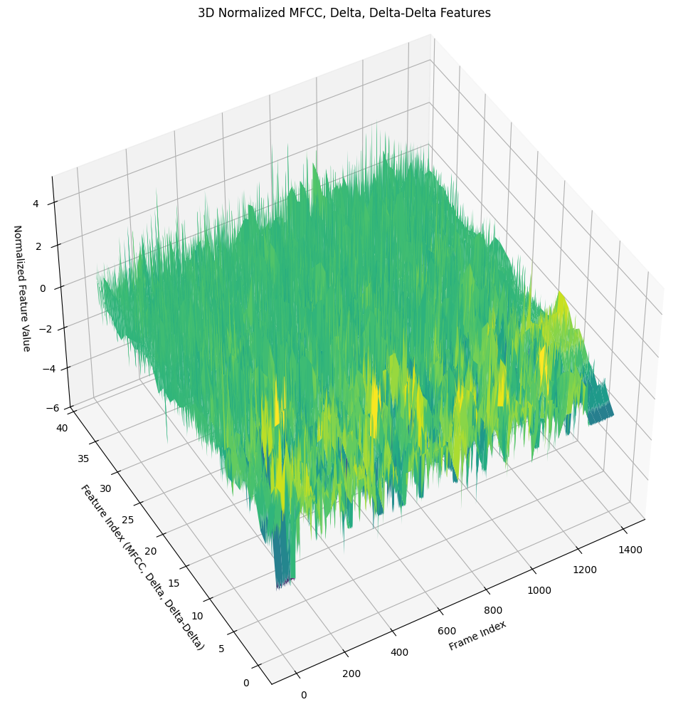

### 3.10 Principal Component Analysis (PCA)

Principal Component Analysis (PCA) is a widely-used dimensionality reduction technique that transforms the feature space into a smaller set of uncorrelated variables, called principal components, while retaining the most important variance within the data. The goal is to reduce the feature set's dimensionality (MFCC, delta, and delta-delta features combined) while preserving as much relevant information as possible. By applying PCA, we eliminate redundant and correlated features, making the data more efficient for processing and analysis, which is especially useful when dealing with high-dimensional feature sets.

In this implementation, PCA reduces the number of features to a specified number of components ( `n_components=12` in this case). This makes the dataset more manageable for machine learning tasks while still maintaining the key patterns and variability present in the original data.

```python
def feature_transformation(features, n_components=12):
    """
    Perform Principal Component Analysis (PCA) on the feature set.

    Args:
        features (numpy.ndarray): The input features to be transformed.
        n_components (int): Number of principal components to keep.

    Returns:
        tuple: (Transformed features, PCA object)
    """
    # Initialize PCA with the desired number of components
    pca = PCA(n_components=n_components)

    # Fit the PCA model to the features and transform the data
    transformed_features = pca.fit_transform(features)

    return transformed_features, pca

# Apply PCA to reduce the dimensionality of the stacked features (MFCC, Delta, Delta-Delta)
transformed_features, pca_model = feature_transformation(stacked_features)
```

This image presents the first 12 principal components (PCs) extracted from the original MFCC, delta, and delta-delta feature set after performing Principal Component Analysis (PCA). Each sub-plot corresponds to one of the principal components, illustrating how the variance is distributed across the time frames (frame index).

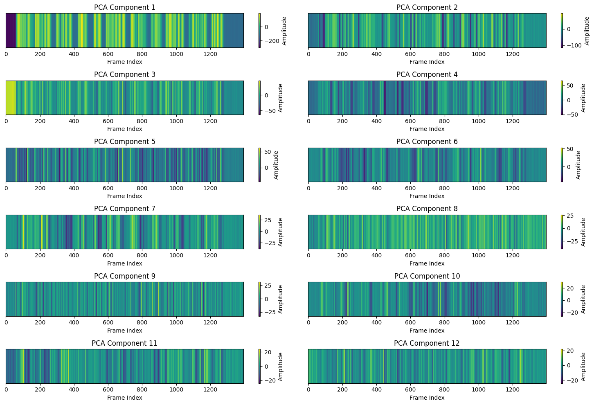

The color intensity represents the amplitude of the features, with brighter regions indicating higher variance and darker regions showing lower variance. As PCA focuses on maximizing variance, the first few components capture the most significant patterns in the data, while subsequent components show diminishing levels of variability. This dimensionality reduction technique helps in reducing redundant information while retaining essential features for further processing.

## 4 Comparison with `librosa` MFCC

In the comparison between the custom MFCC extraction results and the output from the `librosa` MFCC function, the visual patterns appear largely similar. Both spectrograms display consistent amplitude variations across the MFCC coefficient indices, indicating that the overall signal structure is preserved in both methods. However, subtle differences in intensity and smoothness can be observed.

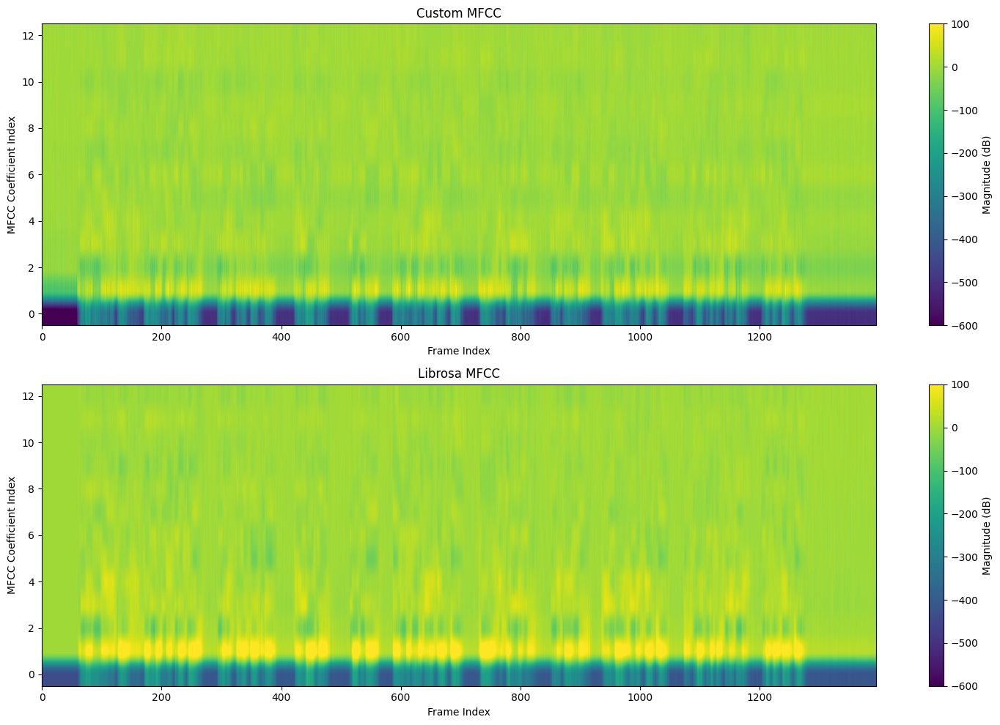

**Possible Reasons for the Differences:**

* **Pre-emphasis and Filtering**: The pre-emphasis filter applied in the custom MFCC extraction might differ slightly from the one used internally by `librosa`. This could lead to minor differences in how high-frequency components are emphasized before further processing.

* **Windowing Technique**: The `librosa` package might use a slightly different windowing technique (Hamming window parameters, overlap ratio, etc.), which would affect the framing of the signal and therefore the resulting spectral features.

* **Mel Filter Bank Implementation**: While both the custom code and `librosa` use the Mel scale for frequency warping, there could be differences in how the Mel filter bank is constructed (e.g., the number of filters, filter bandwidth, and how overlapping is handled). These subtle variations could lead to differences in feature resolution and intensity.

* **Normalization and Scaling**: The scaling and normalization steps in the MFCC computation may vary. `librosa` could apply different normalization strategies to the filter bank or the final MFCC coefficients, leading to small differences in the magnitude of the features.

* **Precision and FFT Settings**: Differences in the FFT resolution (e.g., the number of FFT points) and the precision of the internal computations (floating-point precision, etc.) might contribute to the observed discrepancies in the magnitude and smoothness of the spectral output.

Despite these minor differences, both results capture the same core features of the signal, confirming that the custom implementation aligns well with standard methods.

## 5 Conclusion

In this report, we have walked through the detailed process of extracting Mel Frequency Cepstral Coefficients (MFCC) from an audio signal, starting from the raw waveform to feature transformation and comparison with standard libraries like `librosa`. Each step, from pre-emphasis to windowing, STFT, Mel-filter bank, and feature transformation through DCT and PCA, has been discussed with accompanying visualizations to highlight the process and outcomes.

The custom implementation demonstrates the successful extraction of key features, aligned with human auditory perception, and the dynamic feature extraction further enhances temporal analysis. A comparison with `librosa` shows that while minor differences exist due to the implementation specifics of pre-processing steps, windowing, and filter bank design, the overall MFCC structure is preserved, ensuring the reliability of the custom method.

This step-by-step breakdown provides an insightful understanding of the MFCC extraction process and prepares the groundwork for future work in speech and audio signal analysis, where MFCC features are widely applied in machine learning models for tasks like speech recognition, speaker identification, and audio classification.