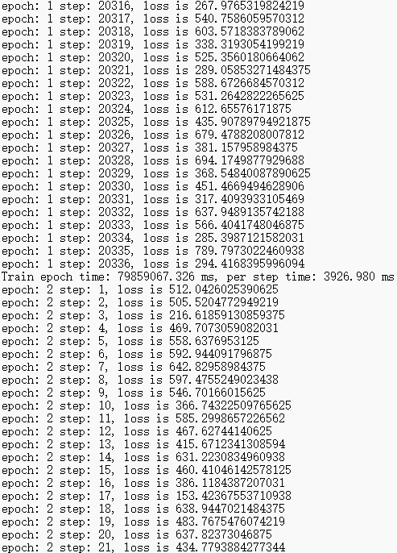
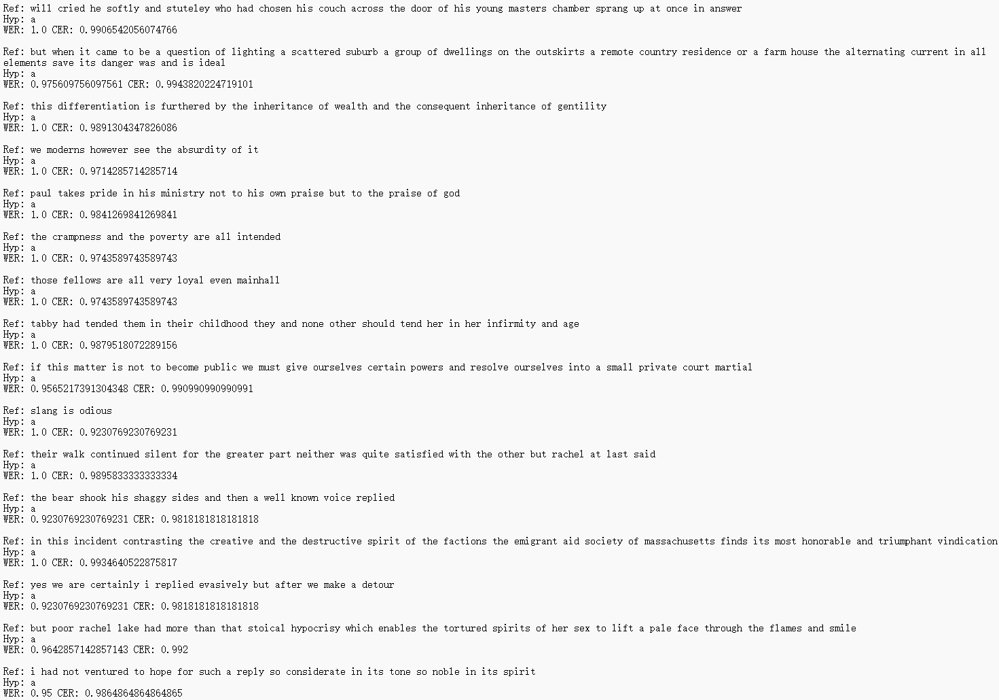

# DeepSpeech2 Speech Recognition Model Based on MindSpore Framework

## 1 Basic Introduction to the Experiment

### 1.1 Experimental Background

With the rapid development of artificial intelligence technology, speech recognition, as an important application field, has received widespread attention. DeepSpeech2, proposed by Baidu Research, is an end-to-end speech recognition model that is trained using the Connectionist Temporal Classification (CTC) loss function. Unlike traditional handcrafted pipelines, DeepSpeech2 uses neural networks to directly learn features from speech signals and generate corresponding text outputs. This model can handle various complex speech scenarios, including noisy environments, different accents, and multiple languages.

MindSpore is an open-source deep learning framework launched by Huawei, aiming to provide an efficient and flexible development experience. MindSpore supports multiple hardware platforms, including CPU, GPU, and Ascend, and is suitable for various scenarios from research to production. Through MindSpore, developers can quickly build and train deep learning models, achieving efficient inference and deployment.

### 1.2 Experimental Objectives

* **Familiarize with the MindSpore training network process**: Through the experiment, learners will understand how to use MindSpore for model building, training, and evaluation, and master the basic usage of MindSpore.
* **Familiarize with the training and evaluation process of the DeepSpeech2 network built with MindSpore**: Learners will gain an in-depth understanding of the architecture design of the DeepSpeech2 model and implement the training and evaluation of this model using MindSpore, mastering how to use MindSpore for end-to-end speech recognition tasks.
* **Understand Linux operating commands**: The experimental platform is based on a Linux environment. Learners will become familiar with common Linux operating commands through the experiment, enhancing their development capabilities on Linux systems.

### 1.3 Experimental Development Environment

* **Experimental Platform**: ECS (Elastic Cloud Server)
* **Framework**: MindSpore 1.6
* **Hardware**: CPU
* **Software Environment**: Python 3.9.0, MindSpore 1.6

## 2 Experimental Process

### 2.1 Environment Preparation

Purchase ECS resources and perform remote login to create the development environment. For specific steps, refer to the "ECS Elastic Server" section in Appendix 3.

### 2.2 Code and Data Download

#### 2.2.1 Obtain Code Files

Use `git` to download the source code of the training script from MindSpore. After connecting to the server using MobaXterm, switch to the home directory, create a working directory, and clone the code repository:

```bash
git clone https://gitee.com/mindspore/models.git
```

The DeepSpeech2 project code for this experiment is located in `models/research/audio/deepspeech2`.

#### 2.2.2 Script Description

The project directory structure is as follows:

```
audio/
└── deepspeech2/
    ├── scripts/
    │   ├── run_distribute_train_gpu.sh    # GPU 8-card training script
    │   ├── run_eval_cpu.sh                # CPU inference script
    │   ├── run_eval_gpu.sh                # GPU inference script
    │   ├── run_standalone_train_cpu.sh    # CPU single-card training script
    │   └── run_standalone_train_gpu.sh    # GPU single-card training script
    ├── train.py                           # Training file
    ├── eval.py                            # Inference file
    ├── export.py                          # Convert MindSpore model to mindir model
    ├── labels.json                        # Possible character mappings
    ├── README.md                          # DeepSpeech2 description
    ├── deepspeech_pytorch/
    │   └── decoder.py                     # Decoder from third-party code (MIT License)
    └── src/
        ├── __init__.py
        ├── DeepSpeech.py                  # DeepSpeech2 network architecture
        ├── dataset.py                     # Data processing
        ├── config.py                      # DeepSpeech configuration file
        ├── lr_generator.py                # Generate learning rate
        ├── greedydecoder.py               # Modified MindSpore code for greedydecoder
        └── callback.py                    # Callback to monitor training
```

#### 2.2.3 Download the LibriSpeech Dataset

Download the dataset from the link: http://www.openslr.org/12

Download only the `train-clean-100` training set (100 hours of noiseless speech training set) and the clean versions of the validation and test sets:

* **Training Set**: `train-clean-100.tar.gz [6.3G]` (Download only this file)
* **Validation Set**: `dev-clean.tar.gz [337M]` (Noiseless)
* **Test Set**: `test-clean.tar.gz [346M]` (Noiseless)

The data format is `wav` and `txt` files. The data needs to be processed using `librispeech.py`.

The data directory structure is as follows:

```
LibriSpeech/
├── train/
│   └── train-clean-100/
├── val/
│   ├── dev-clean.tar.gz
└── test-clean/
    └── test-clean.tar.gz
```

### 2.3 Data Preprocessing

#### 2.3.1 Install Python 3.9.0

Install dependencies:

```bash
sudo apt-get update
sudo apt-get install -y gcc g++ make cmake zlib1g zlib1g-dev openssl libsqlite3-dev libssl-dev libffi-dev unzip pciutils net-tools libblas-dev gfortran libblas3 libopenblas-dev libgmp-dev sox libjpeg8-dev
```

Download and install Python 3.9.0:

```bash
wget https://www.python.org/ftp/python/3.9.0/Python-3.9.0.tgz
tar -zxvf Python-3.9.0.tgz
cd Python-3.9.0
chmod +x configure
./configure --prefix=/usr/local/python3.9.0 --enable-shared
make
sudo make install
```

Set up symbolic links:

```bash
sudo ln -s /usr/local/python3.9.0/bin/python3.9 /usr/bin/python
sudo ln -s /usr/local/python3.9.0/bin/pip3.9 /usr/bin/pip
sudo ln -s /usr/local/python3.9.0/bin/python3.9 /usr/bin/python3.9
sudo ln -s /usr/local/python3.9.0/bin/pip3.9 /usr/bin/pip3.9
```

Verify the installation:

```bash
python3.9 --version
pip3.9 --version
```

#### 2.3.2 Install MindSpore and Dependency Packages

Install MindSpore:

```bash
pip install https://ms-release.obs.cn-north-4.myhuaweicloud.com/1.6.0/MindSpore/cpu/x86_64/mindspore-1.6.0-cp39-cp39-linux_x86_64.whl \
    --trusted-host ms-release.obs.cn-north-4.myhuaweicloud.com \
    -i https://pypi.tuna.tsinghua.edu.cn/simple
```

Install dependency packages:

```bash
pip install wget tqdm sox
```

#### 2.3.3 Download SeanNaren's Data Preprocessing Script

Clone SeanNaren's script repository:

```bash
git clone https://github.com/SeanNaren/deepspeech.pytorch.git
```

#### 2.3.4 LibriSpeech Data Preprocessing

Upload the dataset to the server and ensure the dataset structure is as follows:

```
LibriSpeech/
├── train/
│   └── train-clean-100/
├── val/
│   ├── dev-clean/
└── test-clean/
    └── test-clean/
```

Copy the `librispeech.py` script to the `deepspeech.pytorch` directory:

```bash
cd deepspeech.pytorch
cp ./data/librispeech.py ./
```

Modify the dataset path in `librispeech.py` to ensure it matches the actual dataset location.

Execute the data processing command:

```bash
python librispeech.py
```

Convert the JSON files to CSV files:

Create `json_to_csv.py` in the `deepspeech.pytorch` directory and copy the following code:

```python
import json
import csv
import argparse

parser = argparse.ArgumentParser(description='JSON to CSV Converter')
parser.add_argument("--json", type=str, required=True, help="Path to the JSON manifest file")
parser.add_argument("--csv", type=str, required=True, help="Path to the output CSV file")
args = parser.parse_args()

def trans(jsonfile, csvfile):
    with open(jsonfile, 'r') as jf, open(csvfile, 'w', newline='') as cf:
        writer = csv.writer(cf)
        for line in jf:
            dic = json.loads(line)
            root_path = dic["root_path"]
            for sample in dic["samples"]:
                wav_path = sample["wav_path"]
                transcript_path = sample["transcript_path"]
                res_wav = root_path + '/' + wav_path
                res_txt = root_path + '/' + transcript_path
                writer.writerow([res_wav, res_txt])

if __name__ == "__main__":
    trans(args.json, args.csv)
```

Run the conversion script:

```bash
python json_to_csv.py --json libri_train_manifest.json --csv libri_train_manifest.csv
python json_to_csv.py --json libri_val_manifest.json --csv libri_val_manifest.csv
python json_to_csv.py --json libri_test_clean_manifest.json --csv libri_test_clean_manifest.csv
```

### 2.4 Model Training and Evaluation

#### 2.4.1 Model Training

Create the `deepspeech_pytorch` directory and add the `decoder.py` file:

```bash
mkdir deepspeech_pytorch
cd deepspeech_pytorch
touch decoder.py
```

Copy the `decoder.py` code into the file. Ensure the file content matches the code in the appendix.

Modify the `src/config.py` file:

* Set `batch_size` to 1 (adjust based on server performance).
* Set `epochs` to 1 (adjust based on actual needs).
* Modify `train_manifest` to the actual path of `libri_train_manifest.csv`.
* Modify `test_manifest` to the actual path of `libri_test_clean_manifest.csv`.
* Change the window type in `eval_config` from `hanning` to `hann`.

Install model Python dependencies:

```bash
pip3.9 install -r requirements.txt
pip3.9 install Levenshtein
pip3.9 install -i https://pypi.tuna.tsinghua.edu.cn/simple torch==1.7.1
pip install numpy==1.20.0
pip install numba==0.53.1
```

Download the pre-trained model:

```bash
wget https://ascend-professional-construction-dataset.obs.cn-north-4.myhuaweicloud.com/ASR/DeepSpeech.ckpt
```

Modify the training startup script `run_standalone_train_cpu.sh` to load the pre-trained model:

```bash
#!/bin/bash
PATH_CHECKPOINT=$1
python ./train.py --device_target 'CPU' --pre_trained_model_path $PATH_CHECKPOINT
```

Start model training:

Run the following command in the DeepSpeech2 directory:

```bash
nohup bash scripts/run_standalone_train_cpu.sh '/home/work/models/official/audio/DeepSpeech2/DeepSpeech.ckpt' > train.log 2>&1 &
```

View training logs:

```bash
tail -f train.log
```

Output:



Stop training (optional):

Since training on a CPU server takes a long time, you can stop after a certain number of steps:

```bash
pkill -9 python
```

View the generated `ckpt` files:

In the `checkpoint` folder, view the saved model files.

#### 2.4.2 Model Evaluation

Execute model evaluation:

```bash
bash scripts/run_eval_cpu.sh ./checkpoint/DeepSpeech-1_140.ckpt
```

View evaluation logs:

```bash
tail -f eval.log
Example output:
```

Output:



Since the model was only trained for 150 steps, the WER has not significantly changed, but the CER has decreased. More steps are needed to achieve more accurate results.

Model export:

Modify the following code in `export.py`:

```python
config = train_config
context.set_context(mode=context.GRAPH_MODE, device_target="CPU", save_graphs=False)
with open(config.DataConfig.labels_path) as label_file:
    labels = json.load(label_file)
```

Convert and export the model file:

```bash
python export.py --pre_trained_model_path ./checkpoint/DeepSpeech-1_856.ckpt
```

The exported model file is `DeepSpeech-1_856.mindir`.

## 3 Experimental Summary

This experiment focuses on implementing and training the DeepSpeech2 speech recognition model using the MindSpore framework. The primary objectives were to familiarize learners with the MindSpore framework, understand the architecture of DeepSpeech2, and perform end-to-end speech recognition tasks. The experiment was conducted on an ECS (Elastic Cloud Server) with a CPU environment, using the LibriSpeech dataset for training and evaluation.

### 3.1 Key Steps and Achievements

* **Environment Setup**: The experiment began with setting up the development environment on an ECS server. This included installing Python 3.9.0, MindSpore 1.6, and necessary dependencies.
* **Data Preparation**: The LibriSpeech dataset was downloaded and preprocessed. The dataset was converted from JSON to CSV format to facilitate data loading during training.
* **Model Training**: The DeepSpeech2 model was trained using the MindSpore framework. The training process involved modifying the configuration file (`src/config.py`) to set parameters such as `batch_size`, `epochs`, and data paths. The model was initialized with a pre-trained checkpoint to speed up training.
* **Model Evaluation**: After training, the model was evaluated using the validation set. The evaluation metrics included Character Error Rate (CER) and Word Error Rate (WER). The results showed that the model's performance improved as training progressed, though more epochs were needed for better accuracy.
* **Model Export**: The trained model was exported in the `mindir` format, which is a serialized format used by MindSpore for deployment.

### 3.2 Challenges

* **Training Time**: The primary challenge was the long training time, with a single epoch taking approximately 50 hours on a CPU server. This highlighted the need for optimization or the use of more powerful hardware, such as GPUs or Ascend processors.
* **Data Preprocessing**: The data preprocessing step required careful handling of the LibriSpeech dataset, including converting JSON files to CSV format and ensuring the data paths were correctly configured.

### 3.3 Conclusion

This experiment successfully demonstrated the process of training and evaluating the DeepSpeech2 model using the MindSpore framework. Learners gained hands-on experience with MindSpore's capabilities, including model training, evaluation, and export. The experiment also emphasized the importance of efficient data preprocessing and the need for optimization in deep learning workflows.

## 4 Question for Reflection

**How to Speed Up the Program When It Costs 50 Hours to Train Only an Epoch?**

To significantly reduce the training time of the DeepSpeech2 model, especially when a single epoch takes 50 hours, consider the following strategies:

* **Use GPU or Ascend Hardware**
  * **GPU**: Training on a GPU can drastically reduce the time required for each epoch. GPUs are optimized for parallel processing, which is essential for deep learning tasks.
  * **Ascend**: If available, Ascend processors, such as those provided by Huawei, can offer even higher performance and efficiency compared to GPUs.
* **Optimize Data Loading and Preprocessing**
  * **Parallel Data Loading**: Use data loaders that support multi-threading or multi-processing to load and preprocess data in parallel.
  * **Efficient Data Pipelines**: Ensure that the data pipeline is optimized, minimizing bottlenecks in data loading and preprocessing.
* **Increase Batch Size**
  * **Larger Batch Size**: If the hardware supports it, increasing the batch size can reduce the number of iterations required per epoch, thus speeding up training. However, this may require adjusting the learning rate accordingly.
* **Use Mixed Precision Training**
  * **Mixed Precision**: Implement mixed precision training, which uses 16-bit floating-point numbers (FP16) instead of 32-bit (FP32). This can reduce memory usage and speed up computation.
* **Distributed Training**
  * **Multi-GPU Training**: If multiple GPUs are available, use distributed training to split the workload across multiple devices. MindSpore supports distributed training, which can significantly reduce training time.
* **Optimize Model Architecture**
  * **Model Pruning**: Prune the model to remove unnecessary weights or layers, reducing the computational load.
  * **Quantization**: Quantize the model to reduce the precision of weights and activations, which can speed up inference and training.
* **Use Pre-trained Models**
  * **Fine-tuning**: Instead of training from scratch, fine-tune a pre-trained model. This can reduce the number of epochs required and speed up the training process.

By implementing these strategies, the training time can be significantly reduced, making the DeepSpeech2 model more practical for real-world applications.