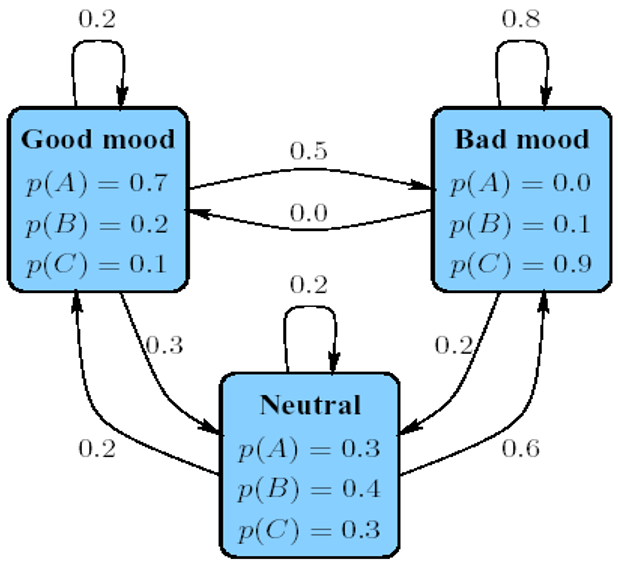

# Viterbi Algorithm

## 1 Introduction

This report details the computational process used to determine the likely "mood curve" of a teacher based on the sequence of homework assignments given across a week. Using a Hidden Markov Model (HMM), we analyzed the observed pattern of assignments to infer the underlying "mood" states each day.

## 2 Problem Setup

The teacher's mood is considered to follow a set of hidden states with specific probabilities of transitioning from one state to another. Each mood influences the assignment given, which serves as our observable data. We use the Viterbi algorithm to calculate the most probable sequence of hidden states (mood states) that correspond to the observed sequence of assignments.

* **States (Moods)**: `Good`, `Neutral`, `Bad`
* **Observations (Assignments)**: `A`, `B`, `C`
* **Observed Sequence (Assignments for each day)**: `[A, C, B, A, C]`

The goal is to determine the most probable sequence of mood states for each day.

## 3 Model Parameters



**Transition Probabilities** (likelihood of moving from one mood state to another):

| Transition From \ To | Good | Neutral | Bad |
| :---: | :---: | :---: | :---: |
| Good | 0.2 | 0.3 | 0.5 |
| Neutral | 0.2 | 0.2 | 0.6 |
| Bad | 0.0 | 0.2 | 0.8 |

**Emission Probabilities** (probability of each assignment given the teacher's mood):

| Mood | A | B | C |
| :---: | :---: | :---: | :---: |
| Good | 0.7 | 0.2 | 0.1 |
| Neutral | 0.3 | 0.4 | 0.3 |
| Bad | 0.0 | 0.1 | 0.9 |

**Start Probabilities** (assumed equal probability of starting in any state):

| Start Probabilities | Good | Neutral | Bad |
| :---: | :---: | :---: | :---: |
| Probability | $1/3$ | $1/3$ | $1/3$ |

## 4 Viterbi Algorithm for Most Probable Mood Sequence

The Viterbi algorithm is applied to compute the maximum likelihood sequence of mood states for the teacher over the week:

* **Initialization**: Calculate the initial probabilities of each state at `t=0` based on the first observation (`A`):

  * For `Good`: $0.333333 \times 0.7 = 0.233333$
  * For `Neutral`: $0.333333 \times 0.3 = 0.100000$
  * For `Bad`: $0.333333 \times 0 = 0.000000$

* **Recursion**: For each subsequent observation, compute the probabilities of being in each state based on the prior state's probability and the current observation's emission probability. This involves:

  * Calculating each possible path to the current state
  * Retaining only the highest probability path

* **Termination**: At the final observation, identify the state with the highest probability for each step back, creating the most probable sequence.

## 5 Detailed Step-by-Step Calculations

Here’s a detailed breakdown of each day’s calculations:

**Day 1 (t=0, Observation = A):**

* `Good`: $0.233333$
* `Neutral`: $0.100000$
* `Bad`: $0.000000$

**Day 2 (t=1, Observation = C):**

* Transition to `Good`: $0.004667$
* Transition to `Neutral`: $0.021000$
* Transition to `Bad`: $0.105000$

**Day 3 (t=2, Observation = B):**

* Transition to `Good`: $0.000840$
* Transition to `Neutral`: $0.008400$
* Transition to `Bad`: $0.008400$

**Day 4 (t=3, Observation = A):**

* Transition to `Good`: $0.001176$
* Transition to `Neutral`: $0.000504$
* Transition to `Bad`: $0.000000$

**Day 5 (t=4, Observation = C):**

* Transition to `Good`: $0.000024$
* Transition to `Neutral`: $0.000106$
* Transition to `Bad`: $0.000529$

## 6 Results

| Mood | A | C | B | A | C |
| :---: | :---: | :---: | :---: | :---: | :---: |
| Good | **0.233333** | 0.004667 | 0.000840 | **0.001176** | 0.000024 |
| Neutral | 0.100000 | 0.021000 | **0.008400** | 0.000504 | 0.000106 |
| Bad | 0.000000 | **0.105000** | 0.008400 | 0.000000 | **0.000529** |

The final Viterbi table in the Results section provides the calculated probabilities for each mood state (Good, Neutral, Bad) across each time step, given the observed assignment sequence `[A, C, B, A, C]`. These probabilities illustrate the most likely path to each mood on each day, determined by both the transition probabilities from prior states and the likelihood of observing each assignment given each state.

The highest probability at each step represents the optimal choice of mood state based on the observed sequence, ultimately leading to the sequence **Good → Bad → Neutral → Good → Bad**. This path signifies the most probable mood progression for the teacher over the week, aligned with the given observations. The Viterbi algorithm's calculations, as detailed, enable a clearer understanding of the inferred "mood curve" by systematically evaluating both transition dynamics and emission likelihoods.

## 7 Appendix

The implementation of the Viterbi algorithm can be run in the `Viterbi_Algorithm.ipynb` file, and it only requires a Python environment with `numpy` installed. The following results are the direct output from the Viterbi algorithm applied to the given model:

```
Step-by-Step Calculation:

t=0, State=Good, Observation=A, Probability=0.233333
t=0, State=Neutral, Observation=A, Probability=0.100000
t=0, State=Bad, Observation=A, Probability=0.000000

Observation at t=1: C
State=Good, Probability=0.004667 (from state Good)
State=Neutral, Probability=0.021000 (from state Good)
State=Bad, Probability=0.105000 (from state Good)

Observation at t=2: B
State=Good, Probability=0.000840 (from state Neutral)
State=Neutral, Probability=0.008400 (from state Bad)
State=Bad, Probability=0.008400 (from state Bad)

Observation at t=3: A
State=Good, Probability=0.001176 (from state Neutral)
State=Neutral, Probability=0.000504 (from state Bad)
State=Bad, Probability=0.000000 (from state Bad)

Observation at t=4: C
State=Good, Probability=0.000024 (from state Good)
State=Neutral, Probability=0.000106 (from state Good)
State=Bad, Probability=0.000529 (from state Good)

Final Viterbi Table:
t=0, State=Good, Probability=0.233333
t=0, State=Neutral, Probability=0.100000
t=0, State=Bad, Probability=0.000000
t=1, State=Good, Probability=0.004667
t=1, State=Neutral, Probability=0.021000
t=1, State=Bad, Probability=0.105000
t=2, State=Good, Probability=0.000840
t=2, State=Neutral, Probability=0.008400
t=2, State=Bad, Probability=0.008400
t=3, State=Good, Probability=0.001176
t=3, State=Neutral, Probability=0.000504
t=3, State=Bad, Probability=0.000000
t=4, State=Good, Probability=0.000024
t=4, State=Neutral, Probability=0.000106
t=4, State=Bad, Probability=0.000529
```